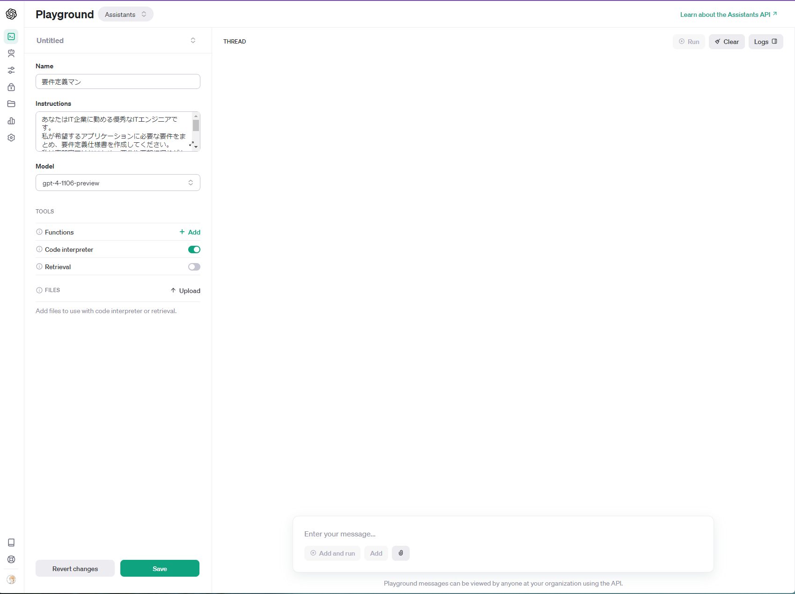

# 0.初めに

## 1.アプリを作るモチベーション

タイトルの通り、筋トレアプリを作ります。

数年ぶりに筋トレを再開したのですが、トレーニング記録アプリの使い心地がすごく悪く、
自分の中の DIY 魂が燃え上がりました。

私ならもっと良いものが作れる！という話ではありません。
自分がもっと気持ちよくトレーニングがしたいというのがモチベーションです。

## 2.記事を書くモチベーション

アプリを作るのはいいけども、正直とても面倒です。

世の中の大切なことは大体めんどくさい的なニュアンスの言葉がありますが、
とにかくめんどくさい。

なので、今回の開発では AI をできるだけ活用します。
近年、AI 技術の発達により将来的には AI が人間の仕事を奪うという話がありますが、
実際どうなの？と疑問に感じています。
実力を見せてもらおうかなといった感じです。

上記の考えから AI を活用したアプリ開発の記事を書いてみようかしらと思いました。

## 3.開発の進め方

アプリの開発は以下のように進めます。

1. 要件定義
2. 基本設計
3. デザイン
4. 実装
5. テスト

オーソドックスな感じです。
要件定義の内容によって、基本設計が割愛されることや追加で設計を行う可能性があります。

# 4. 要件定義

筋トレアプリの要件定義を行っていきます。
要件定義には OpenAI が提供する Assistants API を使用します。
Playground でアシスタントを作成します。


プロンプトは以下です。

```
あなたはIT企業に勤める優秀なITエンジニアです。
私が希望するアプリケーションに必要な要件をまとめ、要件定義仕様書を作成してください。
私は専門家ではないため、要件や要望に漏れがあります。
アプリケーションに必要な要件をあなたから提案してください。
```

モデルはせっかくなので最新・最強の「gpt4-1106-preview」を使用します。
依頼は以下です。

```
私が欲しいのは筋力トレーニング記録を行うアプリです。 スマートフォンでトレーニング記録を行いたいです。

```

回答は以下でした。

```
要件定義仕様書：筋力トレーニング記録アプリ
1. はじめに
本書は、スマートフォン向けの筋力トレーニング記録アプリケーションに関する要件を定義します。本アプリケーションは、利用者が行った筋力トレーニングの詳細を記録し、トレーニングの進捗状況を追跡することを目的とします。

2. 目的
本アプリケーションの目的は、ユーザーにとって使いやすく、各種筋力トレーニングのデータを記録し、分析できるツールを提供することです。

3. 要件
3.1 機能要件
トレーニング記録機能:
種目名（例：ベンチプレス、スクワットなど）
重量
リピート数（回数）
セット数
トレーニング日時
進捗追跡機能:
週間、月間、年間の記録データのグラフ表示
各種目の最高重量記録の更新通知
ユーザー管理機能:
新規登録/ログイン/ログアウト機能
ユーザープロフィール管理（名前、年齢、性別など）
データバックアップおよび同期機能:
クラウドへのデータバックアップ
複数デバイス間のデータ同期
カスタマイズ機能:
使用者が頻繁に行うトレーニング種目のカスタム登録
トレーニングルーチンの設定と記録
3.2 非機能要件
ユーザビリティ:
直感的でわかりやすいユーザーインターフェース
複雑な操作を必要としないシンプルな操作性
パフォーマンス:
アプリケーションの応答時間は2秒以内
スムーズな画面遷移
セキュリティ:
パスワードによるユーザー認証
データの暗号化と安全な通信
スケーラビリティ:
ユーザー数の増加に伴うサーバー負荷の管理・対応
可用性:
年間アップタイム率99％以上
互換性:
iOSおよびAndroidプラットフォームでの動作
3.3 システム要件
デバイス対応:
スマートフォンおよびタブレット
OSバージョン:
iOS 12以上
Android 5.0以上
ネットワーク:
オンライン機能利用時はWi-Fiまたはモバイルデータ接続が必要
3.4 制約事項
初回利用時はユーザー登録が必須
オフライン時にはデータのバックアップおよび同期は利用不可
4. 開発および導入スケジュール
（このセクションでは、プロジェクトのタイムライン、マイルストーン、デリバリー日などを概説します。）

5. 予算
（このセクションでは、推定される開発コスト、運用コストなどを記載します。）

この要件定義仕様書は、さらなる改善や追加のフィードバックに基づいて適宜更新されるものです。実際の開発に着手する前に、ユーザーからのフィードバックを収集し、必要に応じて要件を調整します。
```

まずまずの結果です。

ただ、抽象的な話や正直スコープ外としたい話もあるのでちょっと指摘してみます。

```
僕専用のアプリにしようと思ってたんだけど、どうせならサービスとして公開します。
なので僕以外にも使用するユーザーがいることになります。

複数ユーザーに対応し、また管理機能が必要になると思います。

あまりお金をかけたくないのでデータベースサーバーは運用費が安いところがいいです。
また、管理画面もデザインや実装が手間なのでReact Adminのような管理画面を簡単に作成できる仕組みを導入してください。


機能について要望があります。
・アプリで記録したデータはスマートフォンのヘルスケア機能と連携できるようにしてください
・記録する情報は以下でお願いします。
　・種目名
　・重量
　・回数
　・最大重量
　・合計重量
・使用した部位を肉体の絵で表示してください
・使用した部位がいつ回復するか知りたいです。
・トレーニングはオーソドックスなものは初めから登録されていてほしいです。
・アプリにないトレーニングをユーザーが追加できるようにしてほしいです。
・消費カロリーを知りたいです。
・トレーニングを行った時間と日付を記録してカレンダーで表示したいです。


```

結果は以下です
気になるところなどを指摘して調整していきます。

```
要件定義仕様書（修正版）：筋力トレーニング記録アプリ
3. 要件
3.1 機能要件（追加・修正）
マルチユーザー対応:
各ユーザーごとのアカウント管理とデータの独立性
管理機能:
React Adminなどのフレームワークを用いた管理者用ダッシュボード
ユーザー管理、トレーニングデータ管理、種目マスターの管理など
ヘルスケア連携機能:
スマートフォンのヘルスケア機能とのデータ同期
トレーニング記録機能（修正）:
必須記録情報：種目名、重量、回数、最大重量、合計重量
体の部位マップの表示と利用部位の記録
部位の回復時間推定機能
オーソドックスなトレーニング種目のプリセット登録
ユーザーによるカスタムトレーニング種目の追加機能
消費カロリー計算機能
トレーニング日時の記録とカレンダー表示機能
3.2 非機能要件（追加・修正）
コスト:
データベースサーバーはコストパフォーマンスに優れたクラウドサービスを選択（例：Amazon RDS, Google Cloud SQL, Azure SQL Database）
3.3 システム要件（追加・修正）
データベース:
マルチテナント対応のデータベースアーキテクチャ
サーバー・バックエンド:
コスト効率とスケーラビリティを兼ね備えたサーバーレスかマネージドサービスの利用（例：AWS Lambda + Amazon API Gateway, Google Cloud Functions, Azure Functions）
4. データプライバシーおよびセキュリティ対策
ユーザーの健康関連データを含むため、データのプライバシー保護とセキュリティ対策が重要です。法規制（例：HIPAA, GDPR）の遵守とデータの暗号化、アクセス制御が必須となります。

これらの修正した要件定義は、公開サービスとしての展開を前提に含まれる機能、システム構成、データプライバシーおよびセキュリティ対策を更新しています。これに基づき、開発計画を策定し、開発に着手する前に十分なテストとレビューを行うことが重要です。また、ユーザーテストを通じてアプリケーションのユーザビリティを確認し、改善を続けながらプロダクトを成熟させていくことが推奨されます。
```

最終的には以下のようになりました。

```
要件定義仕様書：筋力トレーニング記録アプリ
1. はじめに
本書は、筋力トレーニングの記録と分析を目的としたスマートフォンアプリケーションの開発に関する要件を定義するものです。本アプリケーションは、利用者にとって使いやすく、各種トレーニングデータの記録と分析ができるツールを提供することを目的とします。

2. 目的
ユーザーが自身のトレーニング記録を管理し、健康をサポートする直感的かつ効果的なフィードバックを提供するアプリケーションを開発することです。また、アプリケーションは管理者による運用管理機能を含みます。

3. 機能要件
利用ユーザー向け
アカウント登録、ログイン、ログアウト機能
トレーニングデータ（種目、重量、回数など）の記録機能
進捗グラフの表示機能
体の部位使用記録機能
消費カロリー計算機能
ヘルスケアアプリ（HealthKit, Google Fitなど）との連携
管理者向け
ユーザー情報とトレーニングデータの管理機能
システム運用状況のモニタリング機能
4. 非機能要件
ユーザービリティ：直感的かつ簡単な操作
パフォーマンス：迅速なアプリケーションの応答
互換性：iOSおよびAndroidプラットフォームでの動作を確保
5. システム要件
モバイルアプリケーションはiOSおよびAndroidに対応する
バックエンドはRESTful APIに基づきNode.jsを使用する
データベースはPostgreSQLを使用する
管理画面はAdminBroを用いて構築する
ホスティングはRender.comのスタータープランを利用する
6. プライバシーとセキュリティ
公開サービスとしての運用にあたり、次のセキュリティおよびプライバシー保護の対策を実施する:

データ暗号化: すべてのトレーニングデータは伝送および格納時に暗号化を施す。
認証と認可: ユーザーは独自のログイン情報を持ち、二要素認証のオプションを提供する。
データ保護規制への準拠: GDPRなどのデータ保護法を遵守し、ユーザーが自身のデータに対するフルアクセスとコントロールを持つようにする。
バックアップと復旧: 定期的なバックアップを行い、災害復旧計画を策定する。
セキュリティオーディト: システムの定期的なセキュリティレビューとオーディトを実施する。
ユーザープライバシー: ユーザープライバシーポリシーを公開し、個人データの使用方法について明確に開示する。
```

要件定義はこの辺で終わりにします。

# 5.感想

思ったよりちゃんとやってくれるなぁというのが正直な感想です。
ただ、まだ気になるところも多く、直すのがめんどくさいなぁと思いました。
仕事ならもっと明確にしろとかもっと明確にしろって言いたくなります。
でも今回は OK です！

記事を書き始めたときは「アプリをつくるぞ～～～～！！！」と燃えていましたが、
今は「実際に作るのはやめない？」くらいのやる気になっています。

AI 君の頑張りでどうするか決めようと思います。
